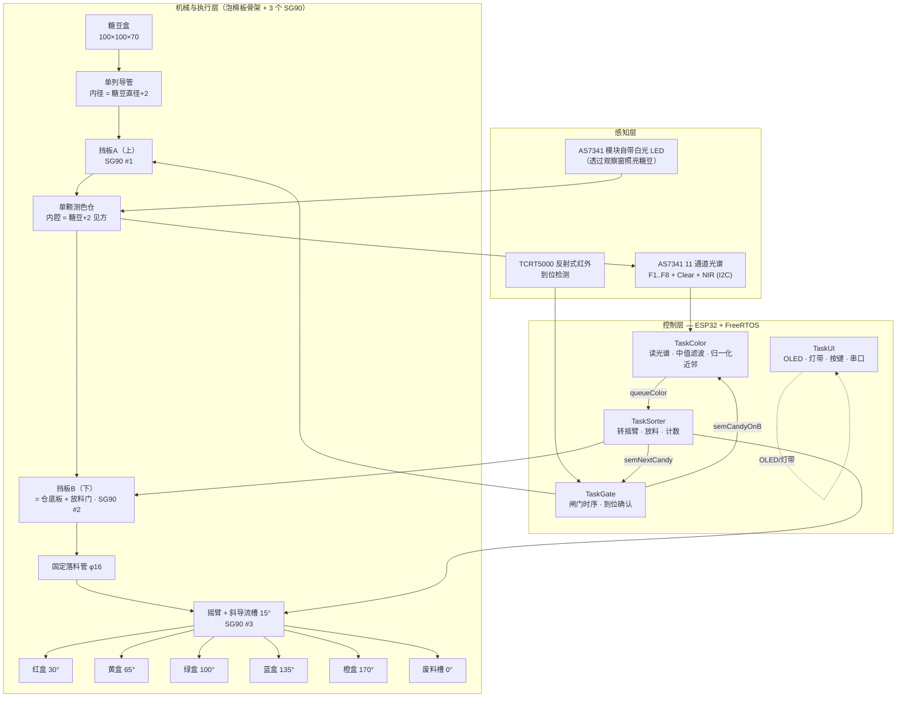
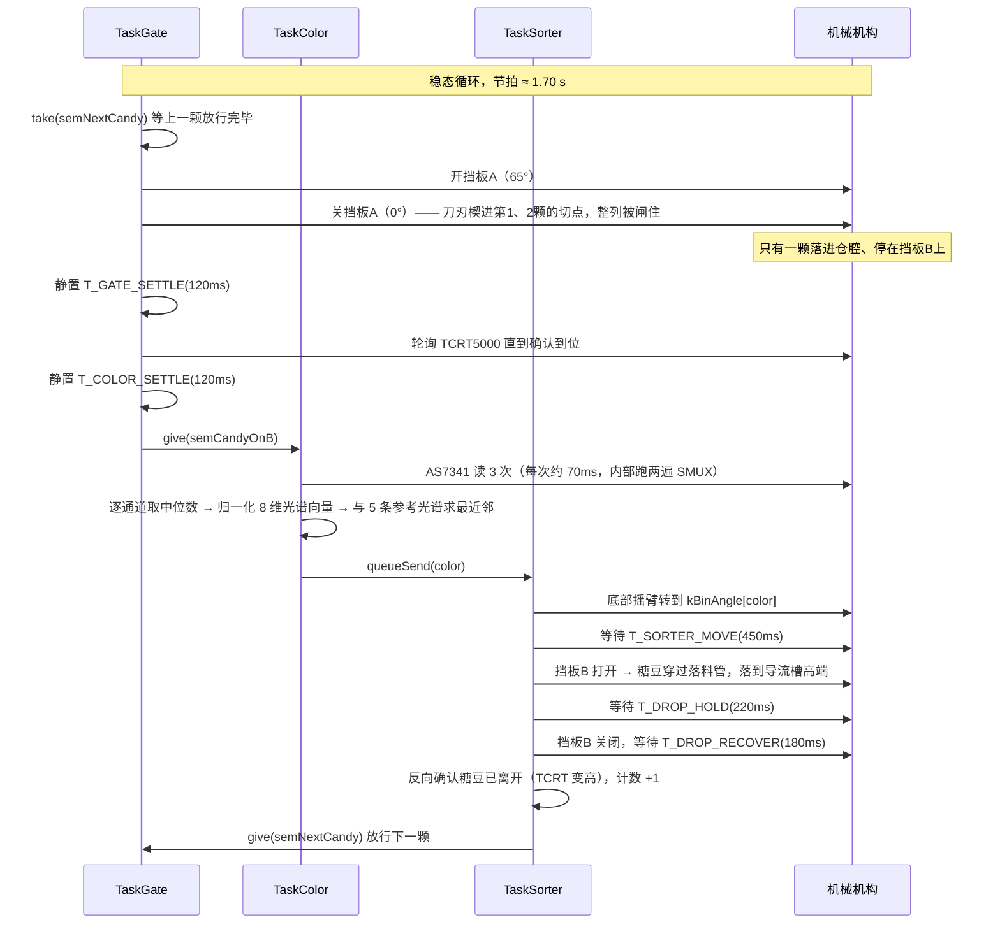

# 01 · 系统架构与技术栈

> 项目：三舵机糖豆分色器 v3（Candy Sorter v3）
> 主控：ESP32 ｜ 框架：Arduino + FreeRTOS ｜ 结构：5 mm 泡棉板手工装配
> 感知：**AS7341 11 通道光谱传感器** ｜ 目标：把糖豆按颜色分进不同方盒

---

## 1. 系统概述

本机器是一台**单颗串行的重力式分色设备**：

```
糖豆盒 → 重力单列导管 → 挡板A(上) → [单颗测色仓] → 挡板B(下)
                                    ↑ A 和 B 之间就是检测仓
                                       B 同时充当仓底板与放料门
         → 固定落料管 → 摇臂上的斜导流槽 → 5 个方形收纳盒 + 1 个废料槽
```

糖豆靠重力进入内径「糖豆直径 + 2 mm」的单列导管（**内径小于两倍糖豆直径，两颗并排在几何上不可能**）。挡板A / 挡板B 一开一合把队列分离出一颗：A 抽开时整列下滑、最下一颗落到 B 上；A 关闭时刀刃正好楔进两颗糖豆的切点，把上面的整列闸住。这一颗被 A 和 B 夹在只有「糖豆 + 2 mm」见方的黑色仓腔里，TCRT5000 确认到位，AS7341 透过遮光罩上的窗口读取 8 个可见光通道判色；底部 SG90 把摇臂上的斜导流槽转到目标盒位，挡板B 抽开，糖豆笔直穿过固定落料管落到导流槽的高端，再靠重力滚进对应盒子。

全程由 **ESP32 上的 FreeRTOS 以 4 个任务并发调度**。

**设计目标**

| 指标 | 目标值 |
|---|---|
| 可分辨颜色 | 5 种（红 / 橙 / 黄 / 绿 / 蓝）|
| 分拣速度 | 25–33 颗/分钟（理论节拍 1.70 s）|
| 判色准确率 | ≥ 95%（遮光并标定后）|
| 卡料率 | ≤ 2 次 / 100 颗 |
| 成本 | 基础版 ≈ ¥250，**不需要 3D 打印机** |
| 可维护性 | 引脚/角度/时序全部集中在 `config.h`，改参数不需要动逻辑 |

---

## 2. 总体架构框图



---

## 3. 分拣时序（单颗糖豆的一个节拍）



**关键点 1：`semNextCandy` 是节拍闸门。**
挡板B 上同时只能有一颗糖豆。`TaskSorter` 必须等 B 关闭到位、**并且确认糖豆真的落走了**，才把节拍还给 `TaskGate`。

**关键点 2：底部摇臂故意「不回待机位」。**
放完料后 SG90 停在刚用过的盒位，等下一颗的颜色结果出来再转，平均省掉约一半的转位行程。只有**空闲超过 5 s** 时才回到 0° 待机位。

---

## 4. 节拍时间预算

| 步骤 | 参数（`config.h`） | 时间 |
|---|---|---:|
| 开挡板A + 关挡板A | `T_GATE_MOVE` × 2 | 300 ms |
| 糖豆落到 B 上静置 | `T_GATE_SETTLE` | 120 ms |
| TCRT5000 到位确认 | `T_ARRIVAL_POLL` 轮询 | 20–50 ms |
| 判色前静置 | `T_COLOR_SETTLE` | 120 ms |
| AS7341 读 3 次 | 3 × (2 × 33.4 ms 积分 + I2C + `T_SAMPLE_GAP`) | 220 ms |
| 底部摇臂转位（最远 170°）| `T_SORTER_MOVE` | 450 ms |
| 开挡板B 放料 | `T_DROP_HOLD` | 220 ms |
| 关挡板B 回位 + 反向确认 | `T_DROP_RECOVER` | 180 ms |
| **合计** | | **≈ 1.70 s** |

理论 **≈ 35 颗/分钟**；实际留出机械抖动余量后按 **25–33 颗/分钟** 验收。

**提速的四个旋钮**（按收益排序）：

| 改动 | 省下 | 代价 |
|---|---|---|
| `AS7341_ATIME` 从 19 降到 9（TINT 33→17 ms）| ≈ 100 ms | 需要更亮的照明，判色略降；高光影响变大 |
| `T_SORTER_MOVE` 调到实测临界值 +20 ms | 最多 150 ms | 转位不到位会撒到盒外 |
| 底部舵机换 MG90S（金属齿，更快更稳）| ≈ 100 ms | +¥10 |
| `COLOR_SAMPLE_TIMES`（3 → 1，不取中值）| ≈ 145 ms | 失去抗反光毛刺能力，不推荐 |

---

## 5. 软件架构：FreeRTOS 任务划分

| 任务 | 优先级 | 绑定核心 | 栈 | 触发方式 | 拥有的硬件 | 职责 |
|---|---:|---:|---:|---|---|---|
| `TaskGate` | 4（最高）| Core 1 | 3072 B | `semNextCandy` | **挡板A** SG90 | 闸门时序、TCRT5000 到位确认、重试与卡料判定 |
| `TaskSorter` | 3 | Core 1 | 3072 B | `queueColor` | **挡板B** + **底部摇臂** SG90 | 转盒位、开 B 放料、确认放走、计数、归还节拍 |
| `TaskColor` | 3 | Core 0 | 4096 B | `semCandyOnB` | AS7341（经 `i2cMutex`）| 读光谱 → 中值滤波 → 归一化最近邻 → 入队 |
| `TaskUI` | 1（最低）| Core 0 | 4096 B | 200 ms 轮询 | OLED / WS2812 / 蜂鸣器 / 按键 / 串口 | 显示、状态灯、人机命令、手动调试模式 |

### 为什么这样分？

**✅ 硬件所有权互斥。** 每个舵机只有一个任务在写：A 归 `TaskGate`，B 和底部摇臂归 `TaskSorter`。这样不存在两个任务同时 `servo.write()` 造成抖动的可能，也不需要为舵机加锁。手动调试模式（串口 `m`）通过 `g_manualMode` 标志让两个机械任务**主动让出**舵机，而不是去抢锁。

**✅ I2C 采样与舵机 PWM 物理隔离。** `TaskColor` 固定在 Core 0；它阻塞在约 220 ms 的光谱采样上时，Core 1 上的舵机时序完全不受影响。AS7341 和 OLED 共用同一条 I2C 总线，靠 `i2cMutex` 串行。

**✅ `TaskUI` 最低优先级。** OLED 刷屏（U2g2 `sendBuffer()` 在 100 kHz I2C 下约 20–30 ms）可以被任意任务打断，绝不会拖慢机械节拍。

**⚠️ 老实说：本机构是严格单件串行的**，不存在真正的流水线并行 —— 挡板B 上只能有一颗糖豆，所以「判色」和「放料」在物理上无法重叠。多任务在这个项目里的价值是**模块化、核间隔离、以及每个动作都能单独调试**，不是吞吐率。

> 想把并行度榨出来，唯一的办法是加**双停位**：在 A/B 之间再留一个储能位，让「上一颗正在放料」和「下一颗正在判色」重叠。代价是机构复杂度翻倍，不建议首选。

---

## 6. 同步原语一览

| 原语 | 类型 | 生产者 → 消费者 | 作用 |
|---|---|---|---|
| `semCandyOnB` | 二值信号量 | `TaskGate` → `TaskColor` | 糖豆已停在挡板B（仓底板）上，可以开始判色 |
| `queueColor` | 队列（深度 4）| `TaskColor` → `TaskSorter` | 传递判色结果（`int`，`-1` = UNKNOWN）|
| `semNextCandy` | 二值信号量 | `TaskSorter` → `TaskGate` | 上一颗已落盒且挡板B 已关闭，允许放下一颗（**节拍闸门**，初值为 1）|
| `i2cMutex` | 互斥量 | `TaskColor` / `TaskUI` | AS7341 与 SSD1306 OLED **共用 I2C 总线**，必须串行访问 |
| `countMutex` | 互斥量 | `TaskSorter` / `TaskUI` | 保护计数数组与总数 |

> ⚠️ **`i2cMutex` 是本项目最容易踩的坑**：AS7341 与 SSD1306 挂在同一条 I2C 上。而且 AS7341 的一次完整读取内部要跑**两遍 SMUX**（F1–F4 一遍、F5–F8 一遍），每遍都要等一个积分周期，中间有大量寄存器读写 —— **锁必须罩住整个 `readAllChannels()`**，中途绝不能让 OLED 插进来抢总线。固件中**所有** I2C 访问都包在 `xSemaphoreTake(i2cMutex, ...)` 内。

**死锁预防**：`i2cMutex` 与 `countMutex` 从不嵌套获取，没有同时持有两个锁的代码路径。所有 `xSemaphoreTake` 都带超时，最坏情况也是继续跑而不是死等。

---

## 7. 判色算法

### 7.1 为什么换掉 TCS34725

TCS34725 只有 R/G/B/C 四个**宽带**通道，红和橙在它眼里几乎是同一个数，全靠色相角硬分。AS7341 有 8 个**窄带**可见光通道，等于给每颗糖豆拍了一条低分辨率的光谱曲线 —— 红和橙的曲线形状明显不同，判色从「比一个角度」变成了「比一条曲线」。

**AS7341 的通道（本固件用的 8 个可见光通道）**

| 下标 | 枚举名 | 中心波长 |
|---:|---|---:|
| 0 | `AS7341_CHANNEL_415nm_F1` | 415 nm（紫）|
| 1 | `AS7341_CHANNEL_445nm_F2` | 445 nm（蓝）|
| 2 | `AS7341_CHANNEL_480nm_F3` | 480 nm（青蓝）|
| 3 | `AS7341_CHANNEL_515nm_F4` | 515 nm（绿）|
| 4 | `AS7341_CHANNEL_555nm_F5` | 555 nm（黄绿）|
| 5 | `AS7341_CHANNEL_590nm_F6` | 590 nm（黄）|
| 6 | `AS7341_CHANNEL_630nm_F7` | 630 nm（红）|
| 7 | `AS7341_CHANNEL_680nm_F8` | 680 nm（深红）|
| — | `AS7341_CHANNEL_CLEAR` | 全通（亮度）|
| — | `AS7341_CHANNEL_NIR` | 近红外（判色不用）|

### 7.2 采样与滤波

```
重复 COLOR_SAMPLE_TIMES(3) 次：读 F1..F8 + Clear + NIR  →  逐通道取中位数
```

用**中位数**而不是平均值：糖豆表面有糖衣反光，偶发的高亮毛刺会把平均值拉偏，中位数对孤立毛刺免疫。

**亮度门限**：中位数 `Clear < MIN_CLEAR_LEVEL` → 判定为「仓里没有糖豆」，不进入分类。这个阈值与 `ATIME` / `ASTEP` / `GAIN` 和 LED 电流强相关，**换档位后必须重新标定**（用串口 `t` 看空仓时的 Clear 值，把阈值设成它的 1.5–2 倍）。

### 7.3 归一化光谱最近邻（正式判色）

```
① 把 8 个通道归一化:  v[i] = F[i] / (F1+...+F8)      ← 各分量之和恒为 1
② 与 5 条标定参考光谱求平方距离:  d = Σ (v[i] - ref[c][i])²
③ 取最近的 c; 若 d > MAX_SPECTRAL_DIST 则判为 UNKNOWN
```

**为什么要归一化？** 糖豆每次停的位置、离传感器的远近、表面反光强度都会有细微差别，直接比较绝对读数会被亮度差异带偏。归一化只保留「光谱**形状**」，把亮度信息整个丢掉 —— 而颜色恰恰就是光谱形状。这是本算法最关键的一步。

**为什么用平方距离而不是色相？** 色相是把一条曲线压成一个数，信息损失大；平方距离直接比较 8 维形状，红/橙这种近邻色也能分开。

`MAX_SPECTRAL_DIST` 默认 0.004：归一化后 8 个分量各约 0.125，0.004 大致相当于每个通道平均偏 2%。调大可容忍更多个体差异（但容易混淆近邻色），调小则更严格（但可能把同色糖豆判成 UNKNOWN）。

### 7.4 未标定时的兜底判色

没标定过也能跑：先用 8 个通道合成一个**伪 RGB**，再算 HSV 色相，查默认色相区间表。

```
B = F2 + F3          (445 + 480 nm)
G = F4 + F5          (515 + 555 nm)
R = F6 + F7 + F8     (590 + 630 + 680 nm)
```

| 索引 | 颜色 | 默认色相区间 | 盒位角度 |
|---:|---|---|---:|
| 0 | RED 红 | `[345,360) ∪ [0,18)` | 30° |
| 1 | ORANGE 橙 | `[18, 42)` | 170° |
| 2 | YELLOW 黄 | `[42, 72)` | 65° |
| 3 | GREEN 绿 | `[72, 165)` | 100° |
| 4 | BLUE 蓝 | `[165, 260)` | 135° |
| — | UNKNOWN | 其余（260–345）| 0° 废料槽 |

伪 RGB 只用来显示一个色相值给人看、以及未标定时兜底，**不参与正式判色**。

> 颜色索引按**色相顺序**排列（红橙黄绿蓝），与盒位角度的顺序是**解耦**的：橙盒按图摆在了最远端 170°。想改盒位摆放只改 `kBinAngle[]`，判色逻辑完全不受影响。

### 7.5 标定流程（串口）

不同批次糖豆、不同 LED 亮度、不同遮光程度都会让光谱偏移，固件支持运行时标定并写入 NVS（掉电保存）：

```bash
t       # 先开原始光谱数据流，核对 MIN_CLEAR_LEVEL（详见 05 文档 §7.1）
c 0     # 把仓里的红糖果标定为 RED —— 会存下这条归一化光谱
c 1     # 换成橙色，标定为 ORANGE
c 2 ... c 4
s       # 保存到 Flash (NVS)
p       # 打印状态、计数、以及 5 条参考光谱
r       # 清除标定，回到默认色相区间兜底模式
```

标定完可以用 `p` 把 5 条参考光谱打出来肉眼比对：**同一种颜色在不同位置应该只有轻微差异，不同颜色的曲线形状应该明显不同**。红和橙的 F6/F7 比例差别是最明显的判据。

---

## 8. 技术栈清单

### 8.1 硬件技术栈

| 层 | 选型 | 说明 |
|---|---|---|
| 主控 MCU | **ESP32-D0WD（DevKitC / NodeMCU-32S）** | 双核 240 MHz、520 KB SRAM、**原生 FreeRTOS** |
| 光谱传感 | **AS7341**（I2C, 0x39）| 11 通道（8 可见光 + Clear + NIR + Flicker），板载白光 LED 由芯片 LDR 引脚驱动 |
| 到位检测 | **TCRT5000** 反射式红外模块 | 数字量输出（DO），判定挡板B 上有没有糖豆 |
| 执行机构 | **SG90 ×3** | 挡板A / 挡板B / 底部摇臂（推荐底部换 MG90S）|
| 显示 | SSD1306 0.96" OLED（I2C, 0x3C）| 与传感器共用 I2C |
| 状态指示 | WS2812 灯珠 + 蜂鸣器 + 按键 | 实时显示判到的颜色 |
| 结构 | **5 mm 泡棉板 / 双层瓦楞板** | 美工刀 + 钢尺 + 热熔胶，不需要 3D 打印机 |
| 供电 | 5 V / 3 A 独立电源 | 3 个 SG90 峰值约 2.1 A，**必须独立供电并与 MCU 共地** |

### 8.2 软件技术栈

| 层 | 工具/库 | 版本 | 用途 |
|---|---|---|---|
| 构建系统 | **PlatformIO**（VS Code 插件）| ≥ 6.x | 依赖管理、编译、烧录、串口监视 |
| 框架 | Arduino-ESP32 Core | 2.x | `setup()/loop()`、`Wire`、`Preferences` |
| **实时调度** | **FreeRTOS**（ESP32 Core 内置）| 10.x | 任务、队列、信号量、互斥量 |
| 传感器驱动 | `Adafruit AS7341` | 最新 | 11 通道光谱读取；依赖 `Adafruit BusIO` |
| 舵机驱动 | `ESP32Servo` | ^3.0.5 | 基于 LEDC 的多路 PWM |
| 显示驱动 | `U8g2` | ^2.35.19 | OLED 文本/图形 |
| 灯带驱动 | `Adafruit NeoPixel` | ^1.12.0 | WS2812 |
| 参数存储 | `Preferences`（NVS）| 内置 | 保存 5 条参考光谱与色相 |

> **API 提示（已经踩过的坑）**：`Adafruit_AS7341::readAllChannels(uint16_t*)` 填进缓冲的顺序是 **F1..F8, CLEAR, NIR**；而 `getChannel()` 用的 `as7341_color_channel_t` 枚举把 `CLEAR_0 / NIR_0` 插在了 F4 和 F5 中间 —— **两者顺序不一致**。固件统一走 `readAllChannels()` + `getChannel(枚举名)`，绝不碰裸缓冲下标。

### 8.3 备选技术栈

| 场景 | 替换方案 | 取舍 |
|---|---|---|
| 想学国产 RTOS | **STM32F103 + RT-Thread** | 中文文档好、设备驱动框架完整；但开发环境配置成本高 |
| 资源极度受限 | **裸机 + 定时器中断状态机** | 无需 RTOS；本机构本来就是单件串行，裸机完全够用，但不便于扩展 |
| 想更准的判色 | **OpenMV Cam H7 / ESP32-CAM** | 可做阈值 `find_blobs()`，还能顺带做形状筛选；成本 +¥120～250 |
| 想更稳的送料 | 加装防架桥振动马达，或换成品**振动盘** | 单颗排队可靠得多；成本 +¥6～150 |
| 想更准的定位 | **28BYJ-48 步进 + ULN2003** 替代底部 SG90 | 角度定位精确、可开环计数；需占用 3–4 个 GPIO、转动更慢 |
| 只想省钱 | **TCS34725 代替 AS7341** | 便宜 ¥20，但红/橙难分；此时把 `MAX_SPECTRAL_DIST` 那套逻辑停用，只走色相兜底 —— 需要改代码 |

---

## 9. 关键技术决策与理由

| 决策 | 理由 |
|---|---|
| **用泡棉板而不是 3D 打印** | 不需要打印机、不需要建模、不用等几小时；改一个尺寸只要重新划一刀。代价是刚性差、会吸水变形，所以受力面要双层对贴、直角处加三角撑 |
| **纯重力送料，不要振动马达** | 单列导管内径 = 糖豆直径 + 2 mm，小于两倍直径，「两颗并排」在几何上不可能，天然单列；去掉振动马达、MOSFET、续流二极管、搅拌舵机，BOM 少 4 项、故障点少一大截 |
| **用双闸门（挡板A + 挡板B）而不是单闸门** | 单闸门只能"挡住/放行"，无法把队列**分离**出一颗；双闸门的 A/B 间距等于一颗糖豆直径，A 抽开时整列下滑、最下一颗落到 B 上，A 关闭时刀刃正好楔进两颗糖豆的切点 —— 纯机械的单粒分离器，不需要传感器数颗数 |
| **挡板B 的闸板面就是仓底板兼放料门** | 图注原文就是这么定的；糖豆静止、黑腔遮光、定距照明，判色最稳。如果让糖豆自由落体穿过检测区，AS7341 的积分时间根本拍不稳 |
| **仓腔只做「糖豆 + 2 mm」见方** | 腔越小，杂光越进不来，LED 的光在腔内多次反射照得越均匀。做大反而会引入大面积杂光 |
| **AS7341 装在遮光罩外面，透过窗口看** | 模块 25 mm 见方，塞不进 15 mm 的仓；贴着窗口看既解决了尺寸问题，又让芯片和板载 LED 一起照到糖豆 |
| **判色用归一化光谱而不是色相** | 归一化把亮度差异整个丢掉，只比较光谱**形状**；8 个窄带通道比 3 个宽带通道的信息量大得多，红/橙这种近邻色也能分开 |
| **摇臂 + 斜导流槽，而不是轴心汤匙** | 图注的方案：槽的高端在摇臂轴心上，所以**无论摇臂停在哪，糖豆都必然落到槽的高端**，不会撒到盒子外面；三角垫块同时决定了坡度和出口高度，结构极简，泡棉板就能做 |
| **废料槽放在 0°，用窄槽而不是方盒** | 摇臂结构下，中位就是某个盒子；未知颜色的糖豆会把那个盒子污染。0° 处的窄槽（宽 20 mm）只在红盒（30°）近角旁边留出 4 mm 间隙，正好够 |
| **`semNextCandy` 做节拍闸门** | 用一个二值信号量就把「放一颗 → 判色 → 放料」串成严格单件流水，杜绝挡板B 上叠两颗 |
| **底部摇臂放完料不回待机位** | 平均省掉一半转位行程；只在空闲 5 s 后回 0°，兼顾安全（误落的糖豆进废料槽）|
| **每个舵机只由一个任务拥有** | 去掉舵机互斥量的同时彻底消除抖动；手动调试靠 `g_manualMode` 让机械任务主动让出，而不是去抢 |
| **挡板B 必须「确认放走了」才计数** | 光开一下闸板就计数是不够的：一颗粘在闸板上的糖豆会被照常计数，下一颗还会叠上来，误差会一直累积。所以放料后要读 TCRT5000 反向确认，没清掉就重开闸板，仍清不掉就不计数、让 TaskGate 下一轮重新处理 |
| **TaskGate 每次开挡板A 前先确认仓是空的** | 上一轮到位超时后，糖豆可能紧接着就落到位了；此时若再开一次 A，就会在挡板B 上叠第二颗。加一道前置检查，既堵住这个洞，也顺便让「卡住的糖豆」能在下一轮被自动重新处理 |
| **`semNextCandy` 的看门狗** | 判色结果万一丢失（队列满、任务异常），糖豆会永远压在挡板B 上而节拍信号再也还不上，整机静默停摆。`TaskSorter` 空闲 5 s 后发现仓里仍有糖豆，就按 `UNKNOWN` 强行放行一次自愈 |
| **手动模式绝不"吞"信号量** | 手动模式若把 `semCandyOnB` / `queueColor` 里的令牌取走丢掉，环路就断了。固件在**取之前**先判断 `g_manualMode`；万一时序上还是取到了，就原样放回，并统一由 `exitManual()` 把残留糖豆送进废料槽 |
| **上电自检 + 锁存 `FAULT`** | GPIO34 是仅输入脚、没有内部上拉，DO 悬空时会乱读到 LOW，固件就会"凭空确认"糖豆到位并空放。上电时仓里必然是空的，先验一次电平；不过就直接锁存故障、拒绝自动分拣（OLED 显示 `FAULT`），避免把错误掩盖成一堆莫名其妙的空计数 |
