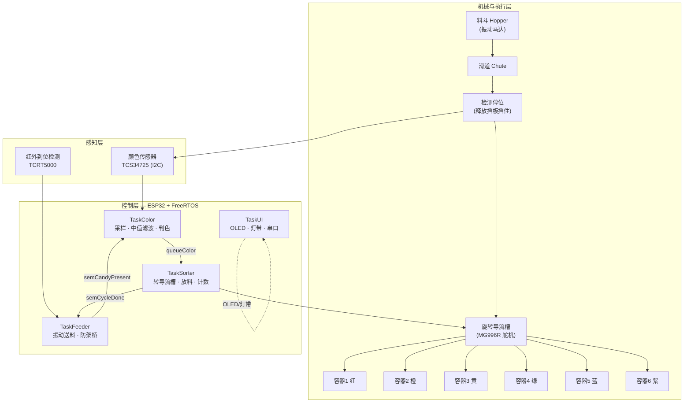
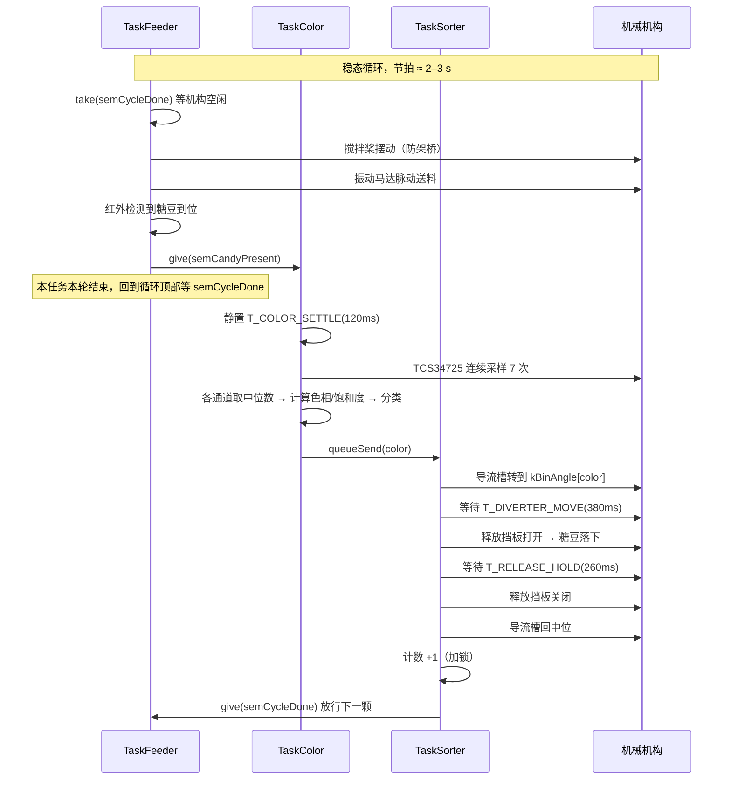

# 01 · 系统架构与技术栈

> 项目：糖豆分拣机（Rainbow Candy Sorter）
> 主控：ESP32 ｜ 框架：Arduino + FreeRTOS ｜ 目标：把彩虹糖按颜色分入不同容器

---

## 1. 系统概述

本机器是一台**单颗串行分拣设备**：糖豆从料斗经振动送料进入检测位，颜色传感器读取 RGB 并分类，旋转导流槽预先转到目标容器方向，释放挡板放行，糖豆落入对应容器。全程由 ESP32 上的 FreeRTOS 以 4 个任务并发调度。

**设计目标**

| 指标 | 目标值 |
|---|---|
| 可分辨颜色 | 6 种（红 / 橙 / 黄 / 绿 / 蓝 / 紫）|
| 分拣速度 | 约 20–30 颗/分钟（单颗串行，节拍 ≈ 2–3 s）|
| 判色准确率 | ≥ 95%（加遮光罩并标定后）|
| 成本 | 基础版 ≈ ¥250 |
| 可维护性 | 引脚/角度/时序全部集中在 `config.h`，改参数不需要动逻辑 |

---

## 2. 总体架构框图



---

## 3. 分拣时序（单颗糖豆的一个节拍）



**关键点**：`semCycleDone` 是整条流水线的**节拍闸门**。送料任务在开始前必须先取到它，分拣任务在动作完成后才归还。这样即使振动送料把检测位塞满，也不会出现两颗糖豆同时进入分拣流程。

---

## 4. 软件架构：FreeRTOS 任务划分

| 任务 | 优先级 | 绑定核心 | 栈 | 周期/触发 | 职责 |
|---|---|---|---|---|---|
| `TaskSorter` | 3（最高）| Core 1 | 4096 B | 队列到达 | 舵机时序、计数，**不可被抢占太久** |
| `TaskColor` | 2 | Core 0 | 4096 B | `semCandyPresent` | 采样 → 中值滤波 → 判色 → 入队 |
| `TaskFeeder` | 2 | Core 1 | 3072 B | `semCycleDone` | 振动送料、防架桥、红外到位检测 |
| `TaskUI` | 1（最低）| Core 0 | 4096 B | 250 ms 轮询 | OLED 刷新、串口命令解析 |

**为什么这样分**

- **双核分工**：`TaskColor` 在 Core 0 阻塞于信号量时，Core 1 的舵机时序不受影响；I2C 采样耗时（7 次 × ~100 ms 积分 ≈ 0.7 s）不会拖慢机械动作。
- **优先级倒置处理**：`TaskSorter` 优先级最高，保证「导流槽已到位 → 挡板打开」这段时序抖动最小；`TaskUI` 最低，OLED 刷屏可以被任意打断。
- **判色放低优先级**：判色是纯耗时操作且不要求实时，牺牲它换取机械节拍稳定。

---

## 5. 同步原语一览

| 原语 | 类型 | 生产者 → 消费者 | 作用 |
|---|---|---|---|
| `semCandyPresent` | 二值信号量 | Feeder → Color | 糖豆已到位，可以开始判色 |
| `semCycleDone` | 二值信号量 | Sorter → Feeder | 本轮分拣完成，允许送下一颗（**节拍闸门**，初值为 1）|
| `queueColor` | 队列（深度 4）| Color → Sorter | 传递判色结果（`int`）|
| `i2cMutex` | 互斥量 | 全部任务 | TCS34725 与 OLED **共用 I2C 总线**，必须串行访问 |
| `countMutex` | 互斥量 | Sorter / UI | 保护计数数组与总数 |

> ⚠️ **`i2cMutex` 是本项目最容易踩的坑**：TCS34725 与 SSD1306 OLED 挂在同一条 I2C 上。如果判色任务正在读传感器而 UI 任务同时 `sendBuffer()`，会出现读数错乱或总线锁死。固件中所有 I2C 访问都包在 `xSemaphoreTake(i2cMutex, ...)` 内。

---

## 6. 判色算法

### 6.1 采样与滤波

```
重复 7 次：读取 TCS34725 原始 R/G/B/C  →  各通道分别取中位数
```

用**中位数**而不是平均值：彩虹糖表面有糖衣反光，偶发的高亮毛刺会把平均值拉偏，中位数对孤立毛刺免疫。

### 6.2 色相分类

由中位数 RGB 计算 HSV 色相角 `H ∈ [0,360)`：

```
mx = max(R,G,B), mn = min(R,G,B), d = mx - mn
S = d / mx                             ← 饱和度
H = 60° × f((g-b)/d)   若 mx = R
  = 60° × ((b-r)/d + 2) 若 mx = G
  = 60° × ((r-g)/d + 4) 若 mx = B
```

**判据一（亮度门限）**：`C < MIN_CLEAR_LEVEL` → 判定为「无糖豆」，不进入分类。
**判据二（饱和度门限）**：`S < MIN_SATURATION` → 判定为白色/背景，返回 `UNKNOWN`。

**判据三（色相归类）**：

| 模式 | 规则 |
|---|---|
| 未标定（默认）| 查固定色相区间表，红色区间跨越 0°（`[345,360) ∪ [0,18)`）|
| 已标定 | 与 6 个标定色相中心比较，取**色相环最短角距离**最近者；距离 > 55° 则判为 `UNKNOWN` |

### 6.3 标定流程（串口）

因为不同批次糖豆、不同 LED、不同遮光程度都会让色相偏移，固件支持运行时标定并写入 NVS（掉电保存）：

```bash
c 0     # 把当前放在传感器下的糖豆标定为 RED
c 1     # 换成橙色糖豆，标定为 ORANGE
c 2 ... c 5
s       # 保存到 Flash
p       # 打印状态与各色计数
r       # 清除标定，恢复默认区间
```

---

## 7. 技术栈清单

### 7.1 硬件技术栈

| 层 | 选型 | 说明 |
|---|---|---|
| 主控 MCU | **ESP32-D0WD（DevKitC / NodeMCU-32S）** | 双核 240 MHz、520 KB SRAM、内置 Wi-Fi/BT、**原生 FreeRTOS** |
| 颜色传感 | **TCS34725**（I2C, 0x29）| 带 IR 滤波，输出 16 位 RGBC，比 TCS3200 抗环境光 |
| 到位检测 | **TCRT5000** 反射式红外 | 数字量输出，判定检测位有无糖豆 |
| 执行机构 | SG90 ×2 + MG996R ×1 | 搅拌桨 / 释放挡板 / 导流槽（MG996R 扭矩大，带得动导流槽）|
| 送料 | 偏心振动马达 + MOSFET | 由 GPIO25 经 AO3400/IRLZ44N 驱动，**不可直接接 GPIO** |
| 显示 | SSD1306 0.96" OLED（I2C, 0x3C）| 与传感器共用 I2C |
| 状态指示 | WS2812 灯珠 + 蜂鸣器 | 实时显示当前判到的颜色 |
| 供电 | 5 V / 3 A 独立电源 | 舵机峰值电流大，**必须独立供电并与 MCU 共地** |

### 7.2 软件技术栈

| 层 | 工具/库 | 版本 | 用途 |
|---|---|---|---|
| 构建系统 | **PlatformIO**（VS Code 插件）| ≥ 6.x | 依赖管理、编译、烧录、串口监视 |
| 框架 | Arduino-ESP32 Core | 2.x | `setup()/loop()`、`Wire`、`Preferences` |
| **实时调度** | **FreeRTOS**（ESP32 Core 内置）| 10.x | 任务、队列、信号量、互斥量 |
| 传感器驱动 | `Adafruit TCS34725` | ^1.4.2 | RGBC 原始数据读取 |
| 舵机驱动 | `ESP32Servo` | ^3.0.5 | 基于 LEDC 的多路 PWM |
| 显示驱动 | `U8g2` | ^2.35.19 | OLED 文本/图形 |
| 灯带驱动 | `Adafruit NeoPixel` | ^1.12.0 | WS2812 |
| 参数存储 | `Preferences`（NVS）| 内置 | 保存标定色相 |

### 7.3 备选技术栈

| 场景 | 替换方案 | 取舍 |
|---|---|---|
| 想学国产 RTOS | **STM32F103 + RT-Thread** | 中文文档好、设备驱动框架完整；但开发环境配置成本高 |
| 资源极度受限 | **裸机 + 定时器中断状态机** | 无需 RTOS；但任务一多就难维护，不推荐 |
| 想更准的判色 | **OpenMV Cam H7 / ESP32-CAM** | 可做阈值 `find_blobs()`，还能顺带做形状筛选；成本 +¥120～250 |
| 想更稳的送料 | 成品**振动盘（vibratory bowl）** | 单颗排队可靠得多；成本 +¥80～150 |
| 想更准的定位 | **28BYJ-48 步进 + ULN2003** 或 **NEMA17 + A4988** | 角度定位精确、可开环计数；需占用 2–4 个 GPIO |

---

## 8. 关键技术决策与理由

| 决策 | 理由 |
|---|---|
| 用 ESP32 而不是普通 Arduino | 双核让「判色」与「舵机时序」物理隔离；FreeRTOS 原生可用；`Preferences` 免去外挂 EEPROM |
| 用 FreeRTOS 而不是 `loop()` 大状态机 | 判色需要 ~0.7 s 阻塞采样，若用单线程，舵机动作会被卡住，节拍抖动大 |
| 用**导流槽**而不是「传送带 + 一排拨片」 | 容器静止，糖豆不会在运输中互相挤压；机械件少，3D 打印即可 |
| 用**释放挡板**把糖豆停住再判色 | 糖豆在运动中被拍摄会因为运动模糊/反光导致误判；静止采样最稳 |
| `semCycleDone` 做节拍闸门 | 用一个二值信号量就把「送料—判色—分拣」串成严格单件流水，避免堆叠 |
| 计数用 `countMutex` 保护 | `TaskSorter` 写、`TaskUI` 读，32 位变量在双核上非原子，必须加锁 |
| 判色失败也照常入队 | 否则未知颜色的糖豆永远堵在检测位，整机停摆；失败时走「废料位」并计入 `UNKNOWN` |
