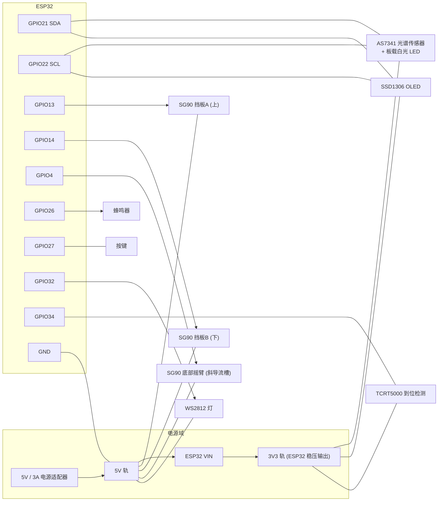

# 03 · 接线图与引脚分配（v3）

> 主控：ESP32 DevKitC（30 pin / 38 pin 通用）
> 本文档给出**完整接线表 + 接线示意图 + 上电检查清单**。

---

## 1. 引脚分配总表

### 1.1 ESP32 侧

| ESP32 引脚 | 方向 | 连接对象 | 信号类型 | 备注 |
|---|---|---|---|---|
| **GPIO 21** | I/O | AS7341 `SDA` + OLED `SDA` | I2C 数据 | 总线需 4.7 kΩ 上拉到 3V3 |
| **GPIO 22** | I/O | AS7341 `SCL` + OLED `SCL` | I2C 时钟 | 同上 |
| **GPIO 13** | OUT | **挡板A（上）** SG90 信号（橙线）| PWM 50 Hz | 舵机电源独立 5 V |
| **GPIO 14** | OUT | **挡板B（下）** SG90 信号（橙线）| PWM 50 Hz | 舵机电源独立 5 V |
| **GPIO 4**  | OUT | **底部摇臂** SG90 信号（橙线）| PWM 50 Hz | 舵机电源独立 5 V |
| **GPIO 34** | IN  | TCRT5000 `DO` | 数字 | ⚠️ **仅输入引脚，无内部上拉**，建议 10 kΩ 上拉到 3V3 |
| **GPIO 26** | OUT | 蜂鸣器模块 `I/O`（或 `I/O` 经 100 Ω）| 方波 | |
| **GPIO 27** | IN  | 按键一端（另一端接 GND）| 数字 | 内部上拉，按下为 LOW |
| **GPIO 32** | OUT | WS2812 `DIN` | 单总线 | 数据线串 330 Ω，建议 5 V 供电 |
| **GPIO 2**  | OUT | 板载 LED | 数字 | 上电即亮，表示已启动 |
| **GPIO 33** | OUT | *（可选）* 外接白光 LED 驱动 | 数字 | **默认不用** —— AS7341 模块自带 LED。见 §5 |
| **GPIO 25** | OUT | *（可选）* 防架桥振动马达 MOSFET 栅极 | 数字 | 默认不用；见 §6 |
| **3V3** | PWR | AS7341 `VIN`、OLED `VCC`、TCRT5000 `VCC` | 3.3 V | 传感器与 OLED 都用 3.3 V |
| **5V / VIN** | PWR | 舵机电源正极（见 §7）| 5 V | **不要**用开发板 5V 给 3 个舵机供电 |
| **GND** | PWR | 所有模块 GND（**必须共地**）| 0 V | 单点接地，避免地环路 |

> ⚠️ **不要使用**：GPIO 6–11（接 Flash，用则无法启动）、GPIO 34–39（仅输入，不能输出）、GPIO 0/2/12/15（strapping，上电电平影响启动模式；GPIO 2 仅用于板载 LED 是安全的）。

### 1.2 与上一版（TCS34725）的引脚变化

| 上一版 | 本版 | 说明 |
|---|---|---|
| AS7341 不存在 | **I2C 上挂 AS7341（0x39）** | 原来是 TCS34725（0x29）。**接线位置完全一样**，只是地址不同 |
| GPIO33 = 白光 LED 驱动三极管 | **GPIO33 改为可选** | AS7341 模块自带白光 LED，由芯片的 LDR 引脚驱动、走 I2C 控制，不再需要外接 LED 和三极管 |
| 舵机引脚 | **不变** | GPIO13 / 14 / 4 含义与上一版完全一致，改装不用重接 |

> **从 TCS34725 换 AS7341 时只需做一件事**：把原来的 TCS34725 模块拔下来，把 AS7341 模块插到同样的 4 根线上（VIN/GND/SDA/SCL）。I2C 地址从 0x29 变成 0x39，接线一根都不用动。

### 1.3 传感器 / 执行器侧

| 模块 | 引脚 | 接到 |
|---|---|---|
| AS7341 | `VIN` / `VCC` | ESP32 `3V3` |
| AS7341 | `GND` | 公共 GND |
| AS7341 | `SDA` | ESP32 `GPIO21` |
| AS7341 | `SCL` | ESP32 `GPIO22` |
| AS7341 | `INT` / `GPIO` | **不接**（本固件用轮询，不用中断）|
| AS7341 | `LDR` / `LED` | **不接**（模块内部已连到板载白光 LED；固件用 `enableLED()` 控制）|
| SSD1306 OLED | `VCC` | ESP32 `3V3` |
| SSD1306 OLED | `GND` | 公共 GND |
| SSD1306 OLED | `SCL` | ESP32 `GPIO22` |
| SSD1306 OLED | `SDA` | ESP32 `GPIO21` |
| TCRT5000 | `VCC` | ESP32 `3V3` |
| TCRT5000 | `GND` | 公共 GND |
| TCRT5000 | `DO` | ESP32 `GPIO34`（**并加 10 kΩ 上拉到 3V3**）|
| 挡板A SG90 | `信号`（橙）| `GPIO13` |
| 挡板B SG90 | `信号`（橙）| `GPIO14` |
| 底部摇臂 SG90 | `信号`（橙）| `GPIO4` |
| SG90 ×3 | `VCC`（红）| **独立 5 V 电源正极** |
| SG90 ×3 | `GND`（棕）| **公共 GND** |
| WS2812 | `DIN` | ESP32 `GPIO32`（串 330 Ω）|
| WS2812 | `5V` / `GND` | 5 V / GND |
| 蜂鸣器模块 | `I/O` | ESP32 `GPIO26` |
| 按键 | 一端 → `GPIO27`，另一端 → `GND` | — |

---

## 2. 接线示意图（ASCII）

```text
                        ┌──────────────────────────────────────┐
                        │            ESP32 DevKitC             │
                        │                                      │
    ┌───────────────────┤ 3V3                             GND  ├───────────┐
    │                   │                                      │           │
    │     ┌─────────────┤ GPIO21 (SDA)                 GPIO22  ├─────┐     │
    │     │             │                                      │     │     │
    │     │             │ GPIO13 ──────────► 挡板A  SG90  信号 │     │     │
    │     │             │ GPIO14 ──────────► 挡板B  SG90  信号 │     │     │
    │     │             │ GPIO4  ──────────► 底部摇臂 SG90 信号 │     │     │
    │     │             │ GPIO26 ──────────► 蜂鸣器 I/O        │     │     │
    │     │             │ GPIO27 ◄────────── 按键 ──► GND     │     │     │
    │     │             │ GPIO32 ──[330Ω]──► WS2812 DIN        │     │     │
    │     │             │ GPIO34 ◄──[10k↑3V3]─ TCRT5000 DO     │     │     │
    │     │             │ GPIO2  ──────────► 板载 LED          │     │     │
    │     │             │ GPIO33 ──(可选, 默认不用)            │     │     │
    │     │             │ GPIO25 ──(可选, 默认不用)            │     │     │
    │     │             └──────────────────────────────────────┘     │     │
    │     │                                                          │     │
    │     │   ┌──────────────────────────────┐                       │     │
    │     └───┤ SDA                          │                       │     │
    │         │   AS7341 光谱传感器 (0x39)   │                       │     │
    │     ┌───┤ SCL    板载白光 LED 由芯片驱动 │                       │     │
    │     │   │ VIN ──► 3V3    GND ──────────┼───────────────────────┘     │
    │     │   └──────────────────────────────┘                             │
    │     │                                                                │
    │     │   ┌──────────────────────────────┐                             │
    │     ├───┤ SDA / SCL                    │                             │
    │     │   │   SSD1306 OLED  (0x3C)       │                             │
    │     │   │ VCC ──► 3V3    GND ──────────┼─────────────────────────────┘
    │     │   └──────────────────────────────┘
    │     │
    │     │   ┌──────────────────────────────┐
    │     ├───┤ VCC  (TCRT5000)               │
    │     └───┤ GND  ──► 公共地               │
    │         │ DO ──► GPIO34                 │
    │         └──────────────────────────────┘
    │
    │     I2C 上拉:  SDA ──[4.7kΩ]── 3V3
    │                SCL ──[4.7kΩ]── 3V3
    │     TCRT 上拉: DO  ──[10kΩ]─── 3V3     ← GPIO34 没有内部上拉，这一颗别省
    │
    ▼
  (3.3V 轨)
```

---

## 3. 连接关系图（Mermaid）



> **注意 Mermaid 图中 `GGND --- RAIL5` 表示「5V 电源的负极与 ESP32 GND 必须连通」**，即共地。这是整机能否正常工作的第一前提。

---

## 4. I2C 总线注意事项

AS7341 与 SSD1306 共用 `GPIO21/22`：

| 事项 | 说明 |
|---|---|
| 地址冲突 | AS7341 = `0x39`，SSD1306 = `0x3C`（少数为 `0x3D`），**不冲突** |
| 上拉电阻 | 两个模块板载通常已各带 4.7 kΩ。**两套并联后等效 ≈ 2.35 kΩ，仍然可用**；若通信不稳，焊掉其中一组 |
| 总线速度 | 固件 `setup()` 里设了 100 kHz。⚠️ 但 **U8g2 的硬件 I2C 层在 `u8g2.begin()` 时可能自己重设总线时钟**（SSD1306 默认 400 kHz），所以实际速率以实测为准。若通信不稳，用 `u8g2.setBusClock(100000)` 显式压回去 |
| **长锁风险** | AS7341 的一次完整读取内部要跑**两遍 SMUX** 并各等一个积分周期，`readAllChannels()` 会占用总线约 70 ms。固件用 `i2cMutex` 把整个读取罩住，**不要**在任务外自己调 `Wire` 或 `readChannel()` |
| 走线 | I2C 是整机里唯一需要穿进检测仓的弱信号线。**从遮光罩前板的线孔穿进去，穿完用黑色热熔胶封住**，否则会漏光 |
| 排查 | 用 Arduino 的 I2C Scanner 确认能看到 `0x39` 与 `0x3C` |

---

## 5. （可选）外接白光 LED 驱动

**默认不需要这一节。** AS7341 模块自带白光 LED，由芯片的 LDR 引脚驱动，固件里 `as7341.enableLED(true)` + `setLEDCurrent(20)` 就能点亮和控制亮度。

只有当你用的是**没有板载 LED** 的 AS7341 模块时，才需要外接：把 `config.h` 里的 `USE_EXTERNAL_LED` 改成 `1`，然后按下面的电路接。

```text
                  5V
                  │
        ┌─────────┼─────────┐
        │                   │
     [100Ω]              [100Ω]
        │                   │
      LED1                LED2          ← 白光 LED，长脚为阳极
        │                   │
        └─────────┬─────────┘
                  │
                  C ┌──────────┐
                  ──┤ 集电极    │
                    │  S8050   │      ← NPN 三极管（或 2N7000 / AO3400 MOSFET）
   GPIO33 ─[1kΩ]── B┤ 基极     │
                    │  发射极   ├──── GND
                    └──────────┘
                        │
                     [10kΩ]              ← 下拉，防止 MCU 复位时 LED 闪
                        │
                       GND
```

| 元件 | 参数 | 作用 |
|---|---|---|
| LED1 / LED2 | φ5 高亮白光，Vf ≈ 3.0–3.2 V，20 mA，色温 6000–6500 K | 仓内照明；**别用暖白**，暖白会让蓝色糖豆的色相偏 |
| R1 / R2 | 100 Ω（(5 V − 3.1 V) / 20 mA ≈ 95 Ω）| LED 限流 |
| Q1 | S8050（NPN）或 2N7000 / AO3400 | 低边开关（GPIO 不能直驱 2 颗 LED）|
| R3 | 1 kΩ | 基极限流 |
| R4 | 10 kΩ | 基极下拉 |

> **为什么默认用模块自带的 LED？** 芯片和 LED 在同一个模块上、相距只有几毫米，等于近似同轴照明，球面糖衣**一定**有一块镜面高光会反射进芯片。这一点靠三件事压制：模块整体偏转 15°–25° 安装、在 LED 那一小片贴白色哑光胶带柔光、以及判色用归一化光谱（高光加的是近似等量的白光，归一化后被摊薄）。详见 `04` 文档 §3。

---

## 6. （可选）防架桥振动马达驱动电路

> 只有当你确实遇到糖豆架桥、并且不想靠手敲时，才需要这一节。
> 打开方式：`config.h` 里把 `ENABLE_VIB_UPGRADE` 改成 `1`，然后重新编译。

GPIO 无法直接驱动马达（3.3 V / 12 mA 上限），必须用 MOSFET 做低边开关。

```text
                 5V
                  │
                  ├──────────────┐
                  │              │
              [振动马达]      [1N5819]      ← 续流二极管, 阴极接 5V
                  │              │             (吸收马达断电反峰)
                  ├──────────────┘
                  │
                  D ┌──────────┐
                  ──┤ 漏极     │
                    │  AO3400  │
   GPIO25 ─[100Ω]──┤ 栅极     │
                    │  源极    ├──── GND
                    └──────────┘
```

| 元件 | 参数 | 作用 |
|---|---|---|
| Q1 | AO3400（N 沟道逻辑电平 MOSFET，SOT-23）| 低边开关 |
| R1 | 100 Ω | 栅极限流、抑制振荡 |
| R2 | 10 kΩ（栅极到 GND）| 下拉，防止 MCU 复位时马达乱转 |
| D1 | 1N5819 肖特基 | 续流，保护 MOSFET |
| M1 | 扁平偏心振动马达（3–5 V，**必须带偏心轮**）| 贴在糖豆盒外壁 |

---

## 7. 舵机供电方案（重要）

3 个舵机**绝对不能**从 ESP32 开发板的 5V 引脚取电。

```text
   ┌──────────────┐
   │ 5V/3A 电源   │
   └──┬────────┬──┘
      │        │
      │        └──[1000µF 电解电容]──┐   ← 抑制 3 个舵机同时启动的瞬时压降
      │                              │
      ├────────► 挡板A  SG90 VCC (红) │
      ├────────► 挡板B  SG90 VCC (红) │
      ├────────► 底部摇臂 SG90 VCC (红)│
      ├────────► WS2812 5V           │
      │                              │
      ├────────► ESP32 VIN (5V) ─────┘
      │
      └────────► GND ──┬── 舵机 GND ×3
                       ├── ESP32 GND
                       ├── 传感器 GND
                       └── (可选) MOSFET 源极
```

**电流估算**

| 器件 | 静态 | 峰值 |
|---|---:|---:|
| SG90 ×3 | ≈ 30 mA | 0.7 A × 3 = 2.1 A |
| AS7341 + OLED（含模块 LED）| ≈ 80 mA | 80 mA |
| WS2812（1 颗）| ≈ 1 mA | 60 mA |
| ESP32 | ≈ 80 mA | 250 mA |
| **合计** | ≈ 190 mA | **≈ 2.5 A** |

⇒ 电源**最低 5 V / 2 A，推荐 5 V / 3 A**，输入端并 1000 µF 电解电容。

**接线顺序（推荐）**

1. 所有 GND 先接在一起（星形单点接地）；
2. 5V 电源同时给舵机与 ESP32 VIN；
3. 舵机信号线最后接 GPIO；
4. 上电前用万用表确认 5V 与 GND 之间**无短路**。

---

## 8. 上电前检查清单

按顺序逐项确认，**全部打勾再上电**：

- [ ] 用万用表蜂鸣档测 **5V 与 GND 之间无短路**
- [ ] 用万用表蜂鸣档测 **3V3 与 GND 之间无短路**
- [ ] 所有模块 GND 已连到**同一个**公共地
- [ ] 舵机 VCC 接的是**独立 5V 电源**，不是 ESP32 的 5V 排针
- [ ] 三个舵机信号线接在 **GPIO13（挡板A）/ GPIO14（挡板B）/ GPIO4（底部摇臂）**，没有接反
- [ ] 舵机信号线（橙/黄）**没有**误接到 3V3 或 5V
- [ ] AS7341 的 `SDA→GPIO21`、`SCL→GPIO22` **没有接反**；`VIN` 接的是 3V3 不是 5V
- [ ] OLED 的 `SDA/SCL` 与传感器并联在同一对引脚上
- [ ] TCRT5000 的 `DO` 接 `GPIO34`（不是 GPIO35 等其它仅输入脚搞混）
- [ ] **TCRT5000 的 `DO` 已加 10 kΩ 上拉到 3V3**。GPIO34 没有内部上拉，DO 一旦接触不良就悬空乱读到 LOW，固件会"凭空确认"糖豆到位
- [ ] 电源正负极**没有接反**
- [ ] **通电前先把三个舵盘拆下来**（或确认舵机可以在 0–180° 自由转动）—— 首次上电时固件会把挡板A/B 关到 0°、摇臂转到 0°，如果机械上已经顶死，会烧舵机
- [ ] 上电瞬间无冒烟、无异味、无异响

---

## 9. 上电后自检流程

| 步骤 | 操作 | 预期现象 |
|---:|---|---|
| 1 | 打开总开关 | ESP32 板载 LED（GPIO2）常亮 |
| 2 | 打开串口监视器（115200）| 打印 `=== Candy Sorter v3.0 booting ===` 与仓腔尺寸 |
| 3 | 观察串口 | 依次打印 `TCRT5000 idle level OK (HIGH)` 与 `AS7341 OK  TINT=33 ms  LED=20 mA`。缺哪一个就查对应的接线与自检 |
| 4 | 观察串口 | AS7341 那一行还会打印 `TINT`（积分时间，单位 ms）与 `LED` 电流，核对是否与 `config.h` 一致 |
| 5 | 观察 OLED | 显示 `CANDY SORTER` 标题 + 5 色计数（全 0）+ `CAL- ---`。右上角若是 `FAULT`，说明自检没过，**自动分拣会被拒绝执行** |
| 6 | 观察底部摇臂 | 上电后先转到 **0°（废料位）**，斜导流槽高端指向机身正前方刻度线 |
| 7 | 观察挡板 | 挡板A、挡板B 都在**关闭**位置 |
| 8 | 观察 WS2812 | 亮灰色（表示暂无判色）|
| 9 | 观察 AS7341 模块 | 模块自带白光 LED 点亮（不亮就查 `enableLED` 与模块型号）|
| 10 | 串口输入 `p` | 打印固件版本、状态、各色计数、盒位角度、摇臂角度、仓腔尺寸 |
| 11 | 串口输入 `h` | 打印完整命令列表 |
| 12 | 串口输入 `m` | 进入手动模式，自动演示：挡板A 开合 → 摇臂 0→180→0 扫描 → 挡板B 开合 |
| 13 | 串口输入 `a 1` / `a 0` | 挡板A 单独开/关，动作干脆无卡滞 |
| 14 | 串口输入 `b 1` / `b 0` | 挡板B 单独开/关 |
| 15 | 串口输入 `d 30` / `d 170` | 斜导流槽出口分别正对红盒 / 橙盒盒心 |
| 16 | 串口输入 `t` | 开始每 300 ms 打印一行 8 通道原始光谱与 Clear/NIR |
| 17 | 在仓里放一颗糖豆 | Clear 值明显升高；`hue` 落在对应颜色的区间里 |
| 18 | 串口输入 `x` | 退出手动模式，恢复自动分拣 |
| 19 | 往糖豆盒倒 20 颗糖豆 | 机器开始逐颗分拣，OLED 计数递增 |
| 20 | 若颜色判错 | 执行标定流程（见 `05_装配与调试指南.md`）|

---

## 10. 常见接线故障对照

| 现象 | 最可能原因 | 处理 |
|---|---|---|
| 串口打印 `AS7341 not found!` | SDA/SCL 接反 / 未共地 / 模块坏 / `VIN` 误接 5V | 用 I2C Scanner 扫描 `0x39`；交换 SDA/SCL 试；确认 VIN 接 3V3 |
| OLED 不亮 | 地址不是 0x3C / VCC 未接 | 试 0x3D；量 VCC 电压 |
| AS7341 模块的 LED 不亮 | 模块没有板载 LED，或 LED 不是 LDR 驱动 | 换成带板载 LED 的模块；或改用 §5 的外接 LED 方案 |
| 光谱读数全为 0 或不变 | I2C 被 OLED 抢了总线 / 模块没供电 | 确认固件用的是 `i2cMutex`；量模块 VCC |
| 舵机抖动、ESP32 复位 | 舵机从开发板取电，瞬时压降 | 改独立 5V 供电 + 并 1000 µF 电容 |
| 舵机不动但有"吱吱"余响 | 信号线未接或接错 GPIO；或已顶到机械限位 | 对照引脚表检查 **GPIO13/14/4**；松开舵盘重新按 `04` 文档 §5.2 的步骤装 |
| 红外一直触发（永远检测到糖豆）| 灵敏度电位器调太高 / 遮光罩漏光 / **GPIO34 悬空** | 调板上电位器；检查遮光罩漏光；**加 10 kΩ 上拉** |
| 串口打印 `TCRT5000 DO reads LOW with an empty chamber!` | DO 没接 / 模块没供电 / 电位器太低 / 引脚悬空 | 按上一行处理；修好后复位 |
| 红外从不触发 | DO 未接 / 电位器调太低 / 探头离糖豆太远 | 调电位器；把探头往前推到距糖豆 5–6 mm |
| 计数乱跳、读到 0x00 | I2C 总线被两任务并发访问 | 确认固件已用 `i2cMutex`；检查是否自行加了 `Wire` 调用 |
| 判色总是 UNKNOWN | 模块 LED 没亮 / 遮光罩漏光 / 亮度门限过高 | 串口 `t` 看 Clear 值；降低 `MIN_CLEAR_LEVEL`；封堵漏光 |
| 判色忽红忽橙 | 糖衣镜面高光直接反射进芯片 | 把 AS7341 模块再偏转几度；在 LED 上贴白色哑光胶带柔光；降低 `AS7341_LED_MA` |
| 串口 `t` 的读数波动很大 | 模块没固定牢 / 仓内有环境光漏进 | 模块四周打胶封光；检查遮光罩接缝 |
| 串口 `p` 里 `rocker now=` 与命令不符 | 底部舵机信号线松动 | 用 `d 90` 单独测试 |
