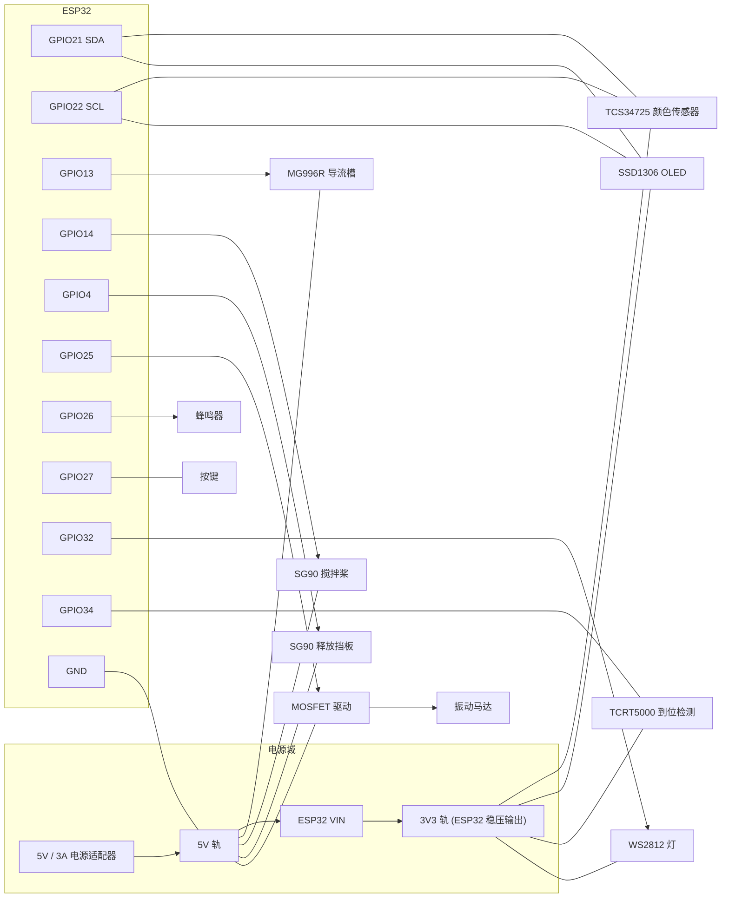

# 03 · 接线图与引脚分配

> 主控：ESP32 DevKitC（30 pin / 38 pin 通用）
> 本文档给出**完整接线表 + 接线示意图 + 驱动电路图 + 上电检查清单**。

---

## 1. 引脚分配总表

### 1.1 ESP32 侧

| ESP32 引脚 | 方向 | 连接对象 | 信号类型 | 备注 |
|---|---|---|---|---|
| **GPIO 21** | I/O | TCS34725 `SDA` + OLED `SDA` | I2C 数据 | 总线需 4.7 kΩ 上拉到 3V3 |
| **GPIO 22** | I/O | TCS34725 `SCL` + OLED `SCL` | I2C 时钟 | 同上 |
| **GPIO 13** | OUT | 导流槽舵机 MG996R 信号（橙线）| PWM 50 Hz | 舵机电源独立 5 V |
| **GPIO 14** | OUT | 搅拌桨舵机 SG90 信号（橙线）| PWM 50 Hz | |
| **GPIO 4**  | OUT | 释放挡板舵机 SG90 信号（橙线）| PWM 50 Hz | |
| **GPIO 25** | OUT | MOSFET 栅极（经 100 Ω）| 数字 | 驱动振动马达，**不可直驱** |
| **GPIO 34** | IN  | TCRT5000 `DO` | 数字 | **仅输入引脚**，无内部上拉，需外部上拉 |
| **GPIO 26** | OUT | 蜂鸣器模块 `I/O`（或 I/O 经 100 Ω）| 方波 | |
| **GPIO 27** | IN  | 按键一端（另一端接 GND）| 数字 | 内部上拉，按下为 LOW |
| **GPIO 32** | OUT | WS2812 `DIN` | 单总线 | 数据线串 330 Ω，建议 5 V 供电 |
| **GPIO 2**  | OUT | 板载 LED | 数字 | 上电即亮，表示已启动 |
| **3V3** | PWR | TCS34725 `VCC`、OLED `VCC`、TCRT5000 `VCC` | 3.3 V | 传感器与 OLED 都用 3.3 V |
| **5V / VIN** | PWR | 舵机电源正极（见供电章节）| 5 V | **不要**用开发板 5V 给 3 个舵机供电 |
| **GND** | PWR | 所有模块 GND（**必须共地**）| 0 V | 单点接地，避免地环路 |

> ⚠️ **不要使用**：GPIO 6–11（接 Flash，用则无法启动）、GPIO 34–39（仅输入，不能输出）、GPIO 0/2/12/15（strapping，上电电平影响启动模式；GPIO 2 仅用于板载 LED 是安全的）。

### 1.2 传感器 / 执行器侧

| 模块 | 引脚 | 接到 |
|---|---|---|
| TCS34725 | `VIN` | ESP32 `3V3` |
| TCS34725 | `GND` | 公共 GND |
| TCS34725 | `SDA` | ESP32 `GPIO21` |
| TCS34725 | `SCL` | ESP32 `GPIO22` |
| TCS34725 | `LED`（若有）| `3V3`（让补光常亮）|
| SSD1306 OLED | `VCC` | ESP32 `3V3` |
| SSD1306 OLED | `GND` | 公共 GND |
| SSD1306 OLED | `SCL` | ESP32 `GPIO22` |
| SSD1306 OLED | `SDA` | ESP32 `GPIO21` |
| TCRT5000 | `VCC` | ESP32 `3V3` |
| TCRT5000 | `GND` | 公共 GND |
| TCRT5000 | `DO` | ESP32 `GPIO34` |
| SG90 / MG996R | `信号`（橙）| GPIO14 / GPIO4 / GPIO13 |
| SG90 / MG996R | `VCC`（红）| **独立 5 V 电源正极** |
| SG90 / MG996R | `GND`（棕）| **公共 GND** |
| WS2812 | `DIN` | ESP32 `GPIO32`（串 330 Ω）|
| WS2812 | `5V` / `GND` | 5 V / GND |
| 蜂鸣器模块 | `I/O` | ESP32 `GPIO26` |
| 按键 | 一端 → `GPIO27`，另一端 → `GND` | — |

---

## 2. 接线示意图（ASCII）

```text
                        ┌──────────────────────────────────────┐
                        │            ESP32 DevKitC             │
                        │                                      │
    ┌───────────────────┤ 3V3                             GND  ├───────────┐
    │                   │                                      │           │
    │     ┌─────────────┤ GPIO21 (SDA)                 GPIO22  ├─────┐     │
    │     │             │                                      │     │     │
    │     │             │ GPIO13 ──────────► 导流槽 MG996R 信号│     │     │
    │     │             │ GPIO14 ──────────► 搅拌桨 SG90  信号 │     │     │
    │     │             │ GPIO4  ──────────► 释放板 SG90  信号 │     │     │
    │     │             │ GPIO25 ──[100Ω]──► MOSFET 栅极      │     │     │
    │     │             │ GPIO26 ──────────► 蜂鸣器 I/O        │     │     │
    │     │             │ GPIO27 ◄────────── 按键 ──► GND     │     │     │
    │     │             │ GPIO32 ──[330Ω]──► WS2812 DIN        │     │     │
    │     │             │ GPIO34 ◄────────── TCRT5000 DO       │     │     │
    │     │             │ GPIO2  ──────────► 板载 LED          │     │     │
    │     │             └──────────────────────────────────────┘     │     │
    │     │                                                          │     │
    │     │   ┌──────────────────────────────┐                       │     │
    │     └───┤ SDA                          │                       │     │
    │         │      TCS34725  (0x29)        │                       │     │
    │     ┌───┤ SCL                          │                       │     │
    │     │   │ VIN ──► 3V3    GND ──────────┼───────────────────────┘     │
    │     │   └──────────────────────────────┘                             │
    │     │                                                                │
    │     │   ┌──────────────────────────────┐                             │
    │     ├───┤ SDA / SCL                    │                             │
    │     │   │   SSD1306 OLED  (0x3C)       │                             │
    │     │   │ VCC ──► 3V3    GND ──────────┼─────────────────────────────┘
    │     │   └──────────────────────────────┘
    │     │
    │     │   ┌──────────────────────────────┐
    │     ├───┤ VCC  (TCRT5000)               │
    │     └───┤ GND  ──► 公共地               │
    │         │ DO ──► GPIO34                 │
    │         └──────────────────────────────┘
    │
    │     I2C 上拉:  SDA ──[4.7kΩ]── 3V3
    │                SCL ──[4.7kΩ]── 3V3
    │
    ▼
  (3.3V 轨)
```

---

## 3. 连接关系图（Mermaid）



> **注意 Mermaid 图中 `GGND --- RAIL5` 表示「5V 电源的负极与 ESP32 GND 必须连通」**，即共地。这是整机能否正常工作的第一前提。

---

## 4. 振动马达驱动电路（MOSFET 低边开关）

GPIO 无法直接驱动马达（3.3 V / 12 mA 上限），必须用 MOSFET 做低边开关。

```text
                 5V
                  │
                  ├──────────────┐
                  │              │
              [振动马达]      [1N5819]      ← 续流二极管, 阴极接 5V
                  │              │             (吸收马达断电反峰)
                  ├──────────────┘
                  │
                  D ┌──────────┐
                  ──┤ 漏极     │
                    │  AO3400  │
   GPIO25 ─[100Ω]──┤ 栅极     │
                    │  源极    ├──── GND
                    └──────────┘
```

**元件表**

| 元件 | 参数 | 作用 |
|---|---|---|
| Q1 | AO3400（N 沟道逻辑电平 MOSFET，SOT-23）| 低边开关 |
| R1 | 100 Ω | 栅极限流、抑制振荡 |
| R2 | 10 kΩ（栅极到 GND）| 下拉，防止 MCU 复位时马达乱转 |
| D1 | 1N5819 肖特基 | 续流，保护 MOSFET |

> 若用成品「继电器/MOS 管模块」，直接把模块 `IN` 接 GPIO25、`VCC`/`GND` 接 5V/GND 即可，省去上述电路。

---

## 5. 舵机供电方案（重要）

3 个舵机**绝对不能**从 ESP32 开发板的 5V 引脚取电。

```text
   ┌──────────────┐
   │ 5V/3A 电源   │
   └──┬────────┬──┘
      │        │
      │        └──[1000µF 电解电容]──┐   ← 抑制舵机启动瞬时压降
      │                              │
      ├────────► 舵机1 VCC (红)      │
      ├────────► 舵机2 VCC (红)      │
      ├────────► 舵机3 VCC (红)      │
      │                              │
      ├────────► ESP32 VIN (5V) ─────┘
      │
      └────────► GND ──┬── 舵机 GND ×3
                       ├── ESP32 GND
                       ├── 传感器 GND
                       └── MOSFET 源极
```

**接线顺序（推荐）**

1. 所有 GND 先接在一起（星形单点接地）；
2. 5V 电源同时给舵机与 ESP32 VIN；
3. 舵机信号线最后接 GPIO；
4. 上电前用万用表确认 5V 与 GND 之间**无短路**。

---

## 6. I2C 总线注意事项

TCS34725 与 SSD1306 共用 `GPIO21/22`：

| 事项 | 说明 |
|---|---|
| 地址冲突 | TCS34725 = `0x29`，SSD1306 = `0x3C`（少数为 `0x3D`），**不冲突** |
| 上拉电阻 | 两个模块板载通常已各带 4.7 kΩ。**两套并联后等效 ≈ 2.35 kΩ，仍然可用**；若通信不稳，焊掉其中一组 |
| 总线速度 | 固件设 100 kHz（`Wire.setClock(100000)`）。长导线（> 20 cm）建议降到 50 kHz |
| 软件互斥 | 固件已用 `i2cMutex` 保护，切勿在任务外直接操作 `Wire` |
| 排查 | 用 Arduino 的 I2C Scanner 确认能看到 `0x29` 与 `0x3C` |

---

## 7. 上电前检查清单

按顺序逐项确认，**全部打勾再上电**：

- [ ] 用万用表蜂鸣档测 **5V 与 GND 之间无短路**
- [ ] 用万用表蜂鸣档测 **3V3 与 GND 之间无短路**
- [ ] 所有模块 GND 已连到**同一个**公共地
- [ ] 舵机 VCC 接的是**独立 5V 电源**，不是 ESP32 的 5V 排针
- [ ] MOSFET 栅极串了 100 Ω，栅极到 GND 有 10 kΩ 下拉
- [ ] 振动马达两端并了续流二极管（**阴极朝 5V**）
- [ ] TCS34725 的 `SDA→GPIO21`、`SCL→GPIO22` **没有接反**
- [ ] OLED 的 `SDA/SCL` 与传感器并联在同一对引脚上
- [ ] TCRT5000 的 `DO` 接 `GPIO34`（不是 GPIO35 等其它仅输入脚搞混）
- [ ] 舵机信号线（橙/黄）接在 GPIO4 / 13 / 14，**没有接到 3V3 或 5V**
- [ ] 电源正负极**没有接反**
- [ ] 上电瞬间无冒烟、无异味、无异响

---

## 8. 上电后自检流程

| 步骤 | 操作 | 预期现象 |
|---:|---|---|
| 1 | 打开总开关 | ESP32 板载 LED（GPIO2）常亮 |
| 2 | 打开串口监视器（115200）| 打印 `=== Candy Sorter booting ===` |
| 3 | 观察串口 | 打印 `TCS34725 OK`；若打印 `TCS34725 not found!` 则查 I2C 接线 |
| 4 | 观察 OLED | 显示 `CANDY SORTER` 标题 + 6 色计数（全 0）|
| 5 | 观察舵机 | 导流槽上电回中位（90°），释放挡板关闭，搅拌桨归位 |
| 6 | 观察 WS2812 | 亮灰色（表示暂无判色）|
| 7 | 串口输入 `p` | 打印状态 `state=1 ...` 与各色计数 |
| 8 | 放一颗糖豆到检测位 | 红外触发 → 串口打印 `[Color] hue=... -> RED`（或对应色）|
| 9 | 观察导流槽 | 转到对应角度，释放挡板开合一次，计数 +1 |
| 10 | 若颜色判错 | 执行标定流程（见 `05_装配与调试指南.md`）|

---

## 9. 常见接线故障对照

| 现象 | 最可能原因 | 处理 |
|---|---|---|
| 串口打印 `TCS34725 not found!` | SDA/SCL 接反 / 未共地 / 模块坏 | 用 I2C Scanner 扫描；交换 SDA/SCL 试 |
| OLED 不亮 | 地址不是 0x3C / VCC 未接 | 试 0x3D；量 VCC 电压 |
| 舵机抖动、ESP32 复位 | 舵机从开发板取电，瞬时压降 | 改独立 5V 供电 + 并 1000 µF 电容 |
| 舵机不动但有余响 | 信号线未接或接错 GPIO | 对照引脚表检查 GPIO4/13/14 |
| 振动马达不转 | MOSFET 栅压不足（用了 IRF540）| 换逻辑电平管 AO3400/IRLZ44N |
| 红外一直触发（永远检测到糖豆）| 灵敏度电位器调太高 / 强光干扰 | 调板上电位器；加遮光罩 |
| 红外从不触发 | DO 未接 / 电位器调太低 | 调电位器，观察板上指示灯 |
| 计数乱跳、读到 0x00 | I2C 总线被两任务并发访问 | 确认固件已用 `i2cMutex`；检查是否自行加了 Wire 调用 |
| 判色总是 UNKNOWN | 补光 LED 未亮 / 遮光不足 / 亮度门限过高 | 让 LED 常亮；加遮光罩；降低 `MIN_CLEAR_LEVEL` |
