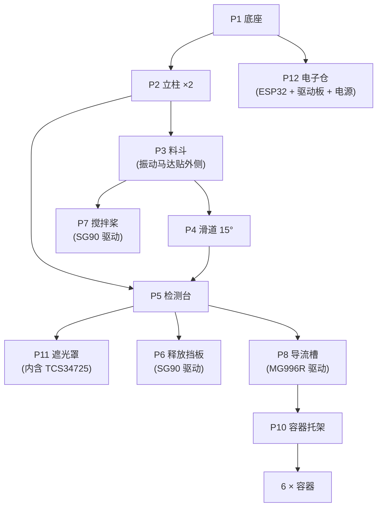

# 04 · 机械结构图纸说明

> 本文用**尺寸表 + 示意图 + 打印参数**描述整机机械结构。
> 所有零件均可 3D 打印（FDM / PLA 即可），无需 CNC。
> 图纸为**原理性尺寸**，首次装配时请按实际糖豆直径（约 12–14 mm）微调。

---

## 1. 整机总体布局

```text
        侧视图 (Side View)                    正视图 (Front View)
   ┌──────────────────────────┐        ┌──────────────────────────┐
   │   ┌────────────────┐     │        │                          │
   │   │   料斗 HOPPER  │     │        │      ┌────────────┐      │
   │   │   (振动送料)    │     │        │      │   料斗      │      │
   │   └───────┬────────┘     │        │      └──────┬─────┘      │
   │           │ 出料口        │        │             │            │
   │      ┌────▼────┐         │        │        ┌────▼────┐       │
   │      │  滑道   │  15°    │        │        │  滑道   │       │
   │      └────┬────┘         │        │        └────┬────┘       │
   │     ══════▼══════        │        │       ══════▼══════       │
   │      [检测停位]  ◄── TCS │        │        [检测停位]         │
   │      [释放挡板]  ◄── SG90│        │        [释放挡板]         │
   │           │              │        │             │            │
   │      ┌────▼────┐         │        │        ┌────▼────┐       │
   │      │ 导流槽  │◄─ MG996R│        │        │ 导流槽  │       │
   │      │(可旋转) │         │        │        └────┬────┘       │
   │      └────┬────┘         │        │      ┌──────┴──────┐     │
   │   ┌───┬───┼───┬───┐      │        │   ┌──┴──┐┌──┴──┐┌──┴──┐  │
   │   │ 1 │ 2 │ 3 │...│ 6    │        │   │  1  ││  2  ││  3  │  │
   │   └───┴───┴───┴───┘      │        │   └─────┘└─────┘└─────┘  │
   └──────────────────────────┘        └──────────────────────────┘
        6 个容器呈 180° 扇形排列
```

**总体尺寸（推荐）**

| 项目 | 尺寸 | 说明 |
|---|---|---|
| 整机占地 | 220 mm × 200 mm | 不含外接电源 |
| 整机高度 | 320 mm | 含料斗 |
| 料斗容积 | ≈ 300 ml | 约可装 150–200 颗糖豆 |
| 容器直径 | 60 mm | 一次性纸杯 / 打印杯 |
| 容器间距 | 30°（半径 90 mm 同心圆）| 6 个容器覆盖 180° |

---

## 2. 零件清单

| 编号 | 零件 | 数量 | 体积/耗材 | 材料 | 打印参数 |
|---:|---|---:|---:|---|---|
| P1 | 底座 Base Plate | 1 | ≈ 45 g | PLA | 0.2 mm 层高，20% 填充 |
| P2 | 立柱 ×2 Column | 2 | ≈ 12 g | PLA | 0.2 mm，30% 填充 |
| P3 | 料斗 Hopper | 1 | ≈ 55 g | PLA | 0.2 mm，15% 填充，**需支撑** |
| P4 | 滑道 Chute | 1 | ≈ 18 g | PLA | 0.2 mm，20%；内壁打磨光滑 |
| P5 | 检测台 Sensor Mount | 1 | ≈ 20 g | PLA | 0.16 mm（尺寸精度要求高）|
| P6 | 释放挡板 Release Gate | 1 | ≈ 6 g | PLA | 0.16 mm |
| P7 | 搅拌桨 Agitator | 1 | ≈ 8 g | PLA | 0.2 mm |
| P8 | 导流槽 Diverter | 1 | ≈ 25 g | PLA | 0.2 mm，内壁打磨 |
| P9 | 导流槽舵盘 Servo Horn Adapter | 1 | ≈ 5 g | PLA | 0.16 mm，与 MG996R 花键配合 |
| P10 | 容器托架 Bin Tray | 1 | ≈ 40 g | PLA | 0.2 mm |
| P11 | 遮光罩 Light Shield | 1 | ≈ 15 g | PLA **或黑色** | 0.2 mm；**必须黑色**，否则漏光 |
| P12 | 电子仓 Electronics Bay | 1 | ≈ 35 g | PLA | 0.2 mm |
| — | **合计耗材** | | **≈ 284 g** | PLA 1 kg 足够 | |

---

## 3. 关键零件详图

### 3.1 P3 料斗 Hopper

```text
        俯视图                        侧剖图
   ┌───────────────┐            ┌───────────────┐
   │ ╲           ╱ │            │╲             ╱│
   │   ╲       ╱   │            │ ╲           ╱ │
   │     ╲   ╱     │            │  ╲         ╱  │
   │       ╳       │            │   ╲       ╱   │  ← 60° 漏斗壁
   │     ╱   ╲     │            │    ╲     ╱    │     (大于糖豆休止角)
   │   ╱       ╲   │            │     ╲   ╱     │
   │ ╱           ╲ │            │      ╲ ╱      │
   └───────┬───────┘            └───────┬───────┘
           │                            │
       出料口 φ18mm                 出料口 φ18mm
```

| 尺寸 | 数值 | 说明 |
|---|---|---|
| 顶部开口 | 120 mm × 120 mm | 便于倒糖豆 |
| 出料口直径 | **φ 18 mm** | 比糖豆（φ13）大 5 mm，**太大易堆叠，太小易卡** |
| 漏斗壁倾角 | **60°** | 糖豆休止角约 25–30°，60° 保证自流 |
| 高度 | 110 mm | |
| 壁厚 | 2.4 mm（6 层 @0.4 喷嘴）| |

> **设计要点**：出料口做成**扁缝形**（18 × 15 mm）效果更好——糖豆只能单层通过，天然减少堆叠。若出现「拱桥」卡料，就是 P7 搅拌桨发挥作用的地方。

### 3.2 P4 滑道 Chute

```text
   侧剖:
        ┌────────────────────────────┐
        │  入料口 (接料斗出料口)      │
        └───────────┬────────────────┘
                    ╲
                     ╲   倾角 15°
                      ╲
                       ╲______________
                                     ╲
                                      ▼ 出料到检测停位
   横剖 (U 形槽):
        ┌───────────────────────┐
        │                       │
        │    槽宽 16 mm         │   ← 略大于糖豆直径
        │    槽深 12 mm         │
        └───────────────────────┘
```

| 尺寸 | 数值 |
|---|---|
| 槽内宽 | 16 mm |
| 槽深 | 12 mm |
| 倾角 | **15°**（可调 10–20°）|
| 长度 | 90 mm |
| 内壁粗糙度 | 打印后砂纸打磨 + 少量滑石粉 |

> 倾角太小糖豆不滚，太大滚太快来不及判色。15° 是实测较好的折中；若糖豆滚动过快，把倾角降到 10°。

### 3.3 P5 检测台 + P11 遮光罩（判色成败的关键）

```text
        侧剖:
                 ┌─────────────────────┐
                 │  遮光罩 (黑色 P11)   │
                 │   ┌───────────────┐ │
                 │   │   TCS34725    │ │  ← 距糖豆 12–15 mm
                 │   └───────┬───────┘ │
                 │           │ 补光 LED │
                 │      ╔════▼════╗     │
                 │      ║  糖豆   ║     │  ← 停在 U 形凹槽里
                 │      ╚═════════╝     │
                 │   ▲            ▲    │
                 │  IR 传感器   释放挡板 │
                 └─────────────────────┘
```

| 尺寸 | 数值 | 说明 |
|---|---|---|
| 传感器到糖豆距离 | **12–15 mm** | 太近视野小，太远信号弱 |
| 遮光罩内腔 | 30 × 30 × 35 mm | 完全包住传感器与糖豆 |
| 遮光罩材料 | **黑色 PLA**（或喷哑光黑漆）| 白色/透明会漏光，判色必偏 |
| 补光 LED | 传感器自带 white LED，**必须常亮** | |
| 停位凹槽 | 与糖豆同径的浅坑（深 3 mm）| 让糖豆停稳不滚 |
| IR 传感器位置 | 停位侧上方，距糖豆 5 mm | 检测有无糖豆 |

> ⚠️ **这是整机最影响准确率的部分**。环境光（日光灯 100 Hz 闪烁、窗户自然光）会让判色剧烈漂移。遮光罩要做到「扣上去看不到内部漏光」的程度。

### 3.4 P8 导流槽 Diverter

```text
        侧剖:                          转到某角度时:
        ┌──────────────┐                    容器 k
        │  入料口      │                      ▲
        │   φ20        │                     ╱
        └──────┬───────┘                    ╱   ← 导流槽出口
               ╲                          ╱
                ╲  弧形导槽              ╱
                 ╲ (R = 60 mm)         ╱
                  ╲                   ╱
                   ╲─────────────────╱
                     出口 φ20

        俯视 (舵机驱动):
                   0°  (红)
                    │
        150° ───────┼─────── 30° (橙)
         (紫)       │        (黄 60°)
             120° ──┴── 90°
             (蓝)      (绿)
```

| 尺寸 | 数值 |
|---|---|
| 入口直径 | φ 20 mm |
| 出口直径 | φ 20 mm |
| 弧半径 | 60 mm |
| 弧行程角 | 75° |
| 材质 | PLA + 内壁打磨 |
| 驱动 | MG996R 花键，通过 P9 舵盘转接 |

**角度映射表**（与固件 `config.h → kBinAngle[]` 一致）

| 颜色索引 | 颜色 | 导流槽角度 |
|---:|---|---:|
| 0 | RED 红 | 0° |
| 1 | ORANGE 橙 | 30° |
| 2 | YELLOW 黄 | 60° |
| 3 | GREEN 绿 | 90° |
| 4 | BLUE 蓝 | 120° |
| 5 | PURPLE 紫 | 150° |
| — | UNKNOWN 废料 | 90°（中位）|

> 若你的舵机行程不足或有机械干涉，直接改 `kBinAngle[]` 的数值即可，无需改逻辑。

---

## 4. 装配爆炸图



---

## 5. 3D 打印建议

| 参数 | 建议值 | 理由 |
|---|---|---|
| 层高 | 0.2 mm（结构件）/ 0.16 mm（配合件）| 配合件精度要求高 |
| 喷嘴 | 0.4 mm | |
| 壁数 | 3 层（1.2 mm）| 保证强度 |
| 填充 | 15%–30% | 结构件 30%，外观件 15% |
| 支撑 | 料斗、导流槽需支撑 | 打印后清除干净，避免残留卡糖 |
| 材料 | **PLA** 即可 | 不与食品长期接触，无需 PETG |
| 后处理 | 滑道/导流槽内壁 **400→800 目砂纸打磨** + 少量滑石粉 | 降低摩擦，糖豆滚得更顺 |
| 遮光罩 | **必须用黑色耗材或喷哑光黑** | 否则判色漂移严重 |

> ⚠️ **食品安全提示**：3D 打印件层间缝隙易藏菌，不建议长期直接接触食品。可在滑道/导流槽内壁贴**食品级 PTFE 胶带**，或定期清洁。本机构用于教学/娱乐演示为宜。

---

## 6. 无 3D 打印机时的替代方案

| 零件 | 替代做法 |
|---|---|
| 料斗 | 剪开的塑料饮料瓶（矿泉水瓶上半部）|
| 滑道 | 对折的硬卡纸 + 胶带，或 PVC 线槽 |
| 检测台 | 亚克力板 + 热熔胶固定传感器 |
| 遮光罩 | 黑色电工胶带缠绕，或黑色卡纸卷筒 |
| 导流槽 | 弯头 PVC 管（φ20）套在舵机上 |
| 底座/立柱 | 木板 / 亚克力 / 乐高积木 |
| 容器托架 | 纸板挖孔 |

用上述替代方案同样可以跑通整机，成本可压到 ¥120 以内，只是外观与重复精度差一些。

---

## 7. 关键尺寸速查表

| 参数 | 数值 | 依据 |
|---|---|---|
| 糖豆直径 | φ 12–14 mm | 标准彩虹糖（Skittles）实测 |
| 出料口直径 | φ 18 mm | 糖豆直径 + 5 mm |
| 滑道槽宽 | 16 mm | 糖豆直径 + 3 mm |
| 滑道倾角 | 15° | 兼顾速度与稳定 |
| 传感器距糖豆 | 12–15 mm | 视野与信号强度折中 |
| 导流槽弧半径 | 60 mm | 与容器半径 90 mm 配合 |
| 容器圆心半径 | 90 mm | 保证落点准确 |
| 容器间角距 | 30° | 6 个容器覆盖 180° |
| 料斗漏斗角 | 60° | 大于糖豆休止角，保证自流 |
